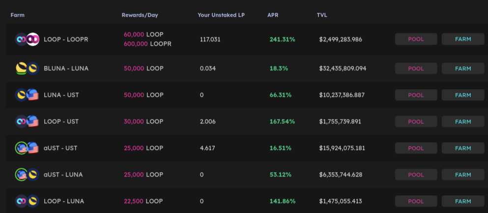
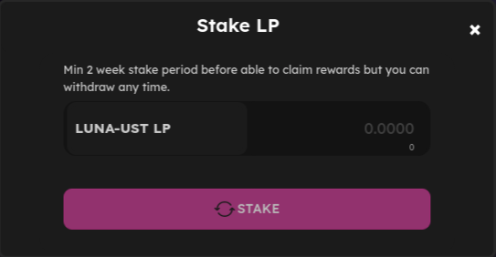
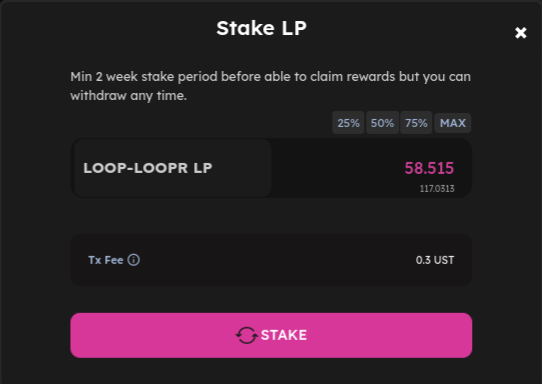
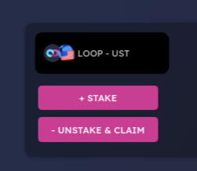
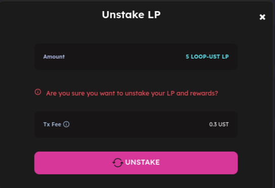
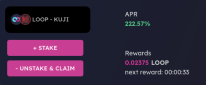

# Farming

Farming is a great way to earn LOOP rewards on LOOPMarket.

## Getting prepared 

Farming takes a little work to get set up.

You’re going to need some "LP Tokens" to enter into a Farm with. Farms can only accept their own exact LP Token. for example, the LOOP-UST Farm will only accept LOOP-UST LP Tokens.

To get the exact LP Token, you'll need to provide liquidity for that trading pair. So to get LOOP-UST LP Tokens, you'll first have to provide liquidity for the LOOP-UST pair.

It may sound intimidating, but it's not too complicated. Let's go through step by step.

### Finding your Farm 

Before you proceed, you'll want to choose a Farm that's right for you. [Visit the Farms page](https://dex.loop.markets/farm2#withdraw) and you’ll see a list of available Farms.

When you find a Farm that you'd like to use, note down the trading pair, e.g. LOOP-UST in case you need it later.

### Providing liquidity to get LP Tokens 

Now that you've found a Farm to stake in, you will need to add liquidity to get your LP Tokens.

1. Click on [POOL](https://dex.loop.markets/pool#provide) to swap the Token Pair to get **LP** tokens.&#x20;

## Putting your LP Tokens into a farm 

Now that you have your LP Tokens, you’re ready to start staking them in a Farm and earning rewards!

### Putting your LP Tokens into the Farm 

1. Go back to the [Farms page](https://dex.loop.markets/farm2#withdraw) and locate your Farm. Click on [Farm](https://dex.loop.markets/farm2#withdraw) and a new window will appear.

Type the amount of LP Tokens you would like to farm with into the field, or just click **Max** to use all of your LP Tokens.

1. When you have the amount entered, the **STAKE** button will light up. Click it. Your wallet will ask you to confirm your action.

1. After a short wait, the window will close, and you will see your new staked LP Token balance in the details

.png>)

## Adding or removing LP Tokens from a Farm 

You may decide you would like to add more LP Tokens to a Farm at a later date, or to take some out of a Farm. You can do this very easily whenever you'd like.

1. Find the Farm you have LP Tokens in, and click the **\[ + ]** or the **Row** to view details. You will see a \[ **- Unstake & CLAIM ]** and \[ **+ Stake ]** button on the left-hand side. Click **\[** **- Unstake & CLAIM ]** to remove LP Tokens, or **\[** **+ Stake ]** to add more LP Tokens.

1. A window will open that looks like the one you used earlier to first stake your LP Tokens. Like last time.

1. Make sure your information is correct. When you are ready, click the **UNSTAKE** button and confirm the action in your wallet.
2. After a short wait, your new balance will show in the details section of your LP Token pair.

## Collecting your farming rewards

Farming will bring you **LOOP** rewards over time. You can collect these rewards and use them to get more LP Tokens, stake them in Farms or anything else you’d like.

### Returning to your Farm to Harvest

To collect your rewards, you’ll need to visit your chosen Farm and collect the **LOOP** waiting for you.

1. Return to the Farms page [here](https://dex.loop.markets/farm2#withdraw).
2. Find the Farm you staked your LP Tokens in, and click the **\[ + ]** or the **Row** to view details. You should see an estimate of your rewards under “Rewards".

1. Click the **UNSTAKE & CLAIM** button and confirm the action in your wallet. After a short wait, the **Reward Tokens** will be claimed to your wallet for you to use as you like.

### How often should I harvest my rewards?

How often you harvest your rewards is up to you, but it does help to remember that there is a small fee transaction involved in harvesting.

Consider leaving your rewards to grow for a while so you pay fees less often.

And that's all there is to!

**Happy Farming!**

We highly encourage you to check out our next article [Stake](stake.md) where you can Stake **LOOP** and earn **LOOP** in reward
