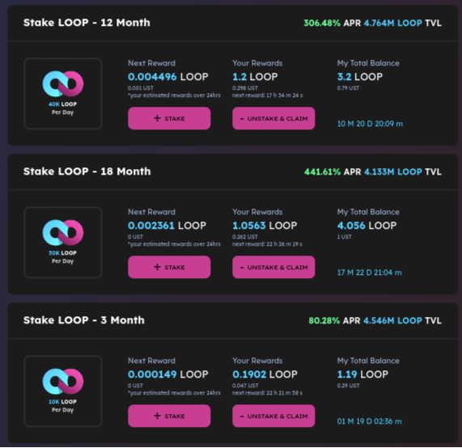
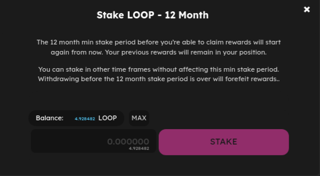
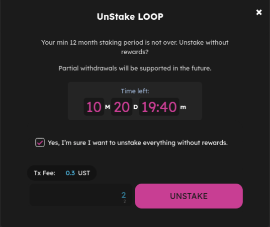

# Staking

## Putting your LOOP Tokens into a farm 

So, you have **LOOP** Tokens, you can start staking them directly and earn **LOOP** Tokens in rewards.

1. Click on the [Stake](https://dex.loop.markets/stake#stake) on the left menu list

.png>)

On the right side you will find a section Where you can see all the available FARM.

Clink on the **+ STAKE** button and Click on [Stake](https://dex.loop.markets/farm2#withdraw) and a new window will appear depending upon the  farm you choose.

Type the amount of **LOOP** Tokens you would like to farm with into the field, or just click **Max** to use all of your **LOOP** Tokens.

1. When you have the amount entered, the **STAKE** button will light up. Click it. Your wallet will ask you to confirm your action.

1. After a short wait, the window will close, and you will see your new staked **LOOP** Token balance in **My Total Balance** section (rewards will be included in this amount).

.png>)

## Removing LOOP Tokens 

You may decide you would like to take LOOP Tokens out which you have staked. You can do this very easily whenever you'd like.

1. You see a  **- UNSTAKE & CLAIM** button. Click this button to remove your **LOOP** Tokens.

.png>)

1. A window will open that looks like the one you used earlier to first stake your **LOOP** Tokens. Like last time

1. Read the instructions and make sure your information is correct. When you are ready, click the **UNSTAKE** button and confirm the action in your wallet.

## **G**overnance

The LOOP Token ($LOOP) is Loop Finance's native governance token. The first and foremost functionality of the token allows holders to participate in governance on the protocol. Users can deposit LOOP tokens to create governance polls, and LOOP stakers can vote to decide on community grants protocol updates, and parameter changes.

&#x20;
